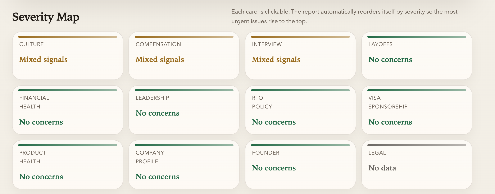

# KnowYourCompany

**Stop wasting interviews on companies that are quietly falling apart.**

KnowYourCompany is a Claude Code skill that researches a company and generates a structured, offline HTML report — in about 2 minutes — so you know what you're walking into before you spend weeks in a hiring process.

---

## Why this exists

Job searches are exhausting. You apply, you prep, you interview — and then you find out the company had layoffs last month, is drowning in lawsuits, or has a culture that burns people out in six months.

This tool is built for candidates who want **signal before they commit their time**.

---

## What it is NOT

- Not a stock screener or investment tool
- Not for financial modeling or valuation
- Not a substitute for legal or financial advice

This is built for one thing: **helping you decide where to spend your time**.

---

## What it covers

Each report analyzes 12 areas, automatically ranked by severity:

| Area | What it looks for |
|---|---|
| Layoffs | Recent cuts, headcount reductions, affected teams |
| Financial health | Funding rounds, runway signals, revenue trajectory |
| Leadership | C-suite turnover, founder involvement, recent exits |
| Legal & regulatory | Lawsuits, class actions, regulatory enforcement |
| Culture | Glassdoor, Blind, Reddit — recurring themes |
| Remote / hybrid policy | Official policy and recent RTO changes |
| Compensation | Salary ranges, equity type, benefits signals |
| Interview experience | Number of rounds, ghosting reports, offer rescissions |
| Visa sponsorship | Country-specific sponsorship programs and status |
| Product & market health | Ratings, growth signals, major incidents |
| Company history | Founding, milestones, business model, headcount |
| Founder background | Prior companies, notable achievements, controversies |

---

## What you get

A single HTML file that opens in any browser — no login, no internet required after download.

- Severity map at the top so the biggest concerns are immediately visible
- Red / yellow / green / grey badges per section
- Collapsible sections with cited sources
- Dark mode
- Sections auto-sorted so red flags appear first



---

## How to use it

### Requirements

- [Claude Code](https://claude.ai/code)
- Claude Code authenticated via `claude auth login`

No `ANTHROPIC_API_KEY` is required for the local runtime path in this repo.

### Setup

1. Copy this folder into `~/.claude/commands/`
2. Open Claude Code
3. Type `/KnowYourCompany`

Claude will ask for the company name, office location (optional), and your target role (optional), then run the research and produce the report.

---

## How the pipeline reduces token usage

The original [KnowYourCompany skill](https://github.com/bluebluegrass/KnowYourCompany) runs entirely inside a single Claude Code session — Claude does everything: searches the web, reads pages, writes findings, and produces the HTML. That works well interactively, but sends a large and growing context to the model on every run.

This repo adds a Node.js pipeline that restructures the work around one principle: **use the model only for judgment, use code for everything else**.

| Task | Original skill | This pipeline |
|---|---|---|
| Web search | Claude tool call | Code (search client) |
| Page fetching | Claude tool call | Code (fetcher + cache) |
| Deduplication | Claude (implicit) | Scored and deduped before the model sees anything |
| Evidence selection | Claude sees all raw results | Per-section caps — only top-N snippets sent |
| Section analysis | One large prompt per section | Compact structured packet; cached by evidence hash |
| HTML rendering | Claude writes the HTML | Template + string replacement, no model call |
| Re-render | Full re-run required | Load `.report.json`, render locally — zero token cost |

### Specific mechanisms

**Per-section evidence budgets** — Each of the 12 sections has explicit caps (`maxQueries`, `maxFetchedPages`, `maxEvidenceItems`, `maxCommunityItems`) in `src/config/sections.ts`. The model never sees raw search results; it receives a trimmed, scored packet.

**Evidence scoring and deduplication** — Snippets are scored by recency, source trust, and relevance. Near-duplicate content from the same domain is dropped before the prompt is built.

**Cache by evidence hash** — Each section analysis is cached keyed on a SHA-256 of the evidence sent. Re-running on the same data costs nothing.

**Output is always English** — No translation pass. The model writes English directly.

**HTML rendering is code, not AI** — The model produces a `ReportModel` JSON saved to disk. A template-and-string-replacement renderer converts it to HTML. Re-rendering after a design change costs zero tokens.

---

## Repo structure

```text
KnowYourCompany/
├── KnowYourCompany.md            — the skill (copy to ~/.claude/commands/)
├── README.md
├── references/
│   ├── template.html             — HTML skeleton for the report
│   └── styles.css                — visual source of truth
├── src/
│   ├── cli.ts                    — entry point: --render, --full, or interactive
│   ├── report/orchestrator.ts    — research pipeline, writes .report.json
│   ├── render/report-renderer.ts — JSON → HTML, no AI calls
│   ├── evidence/                 — scoring, deduplication, packet builder
│   ├── retrieval/                — search client, fetcher, recency filters
│   ├── model/                    — model client, section analyzer, schema validation
│   ├── prompts/                  — per-section and summary prompt builders
│   └── config/                   — section definitions and per-section budgets
└── examples/
    ├── Sardine_KnowYourCompany_2026-04-16.html
    └── Poki_bg_check_2026-04-15.html
```
